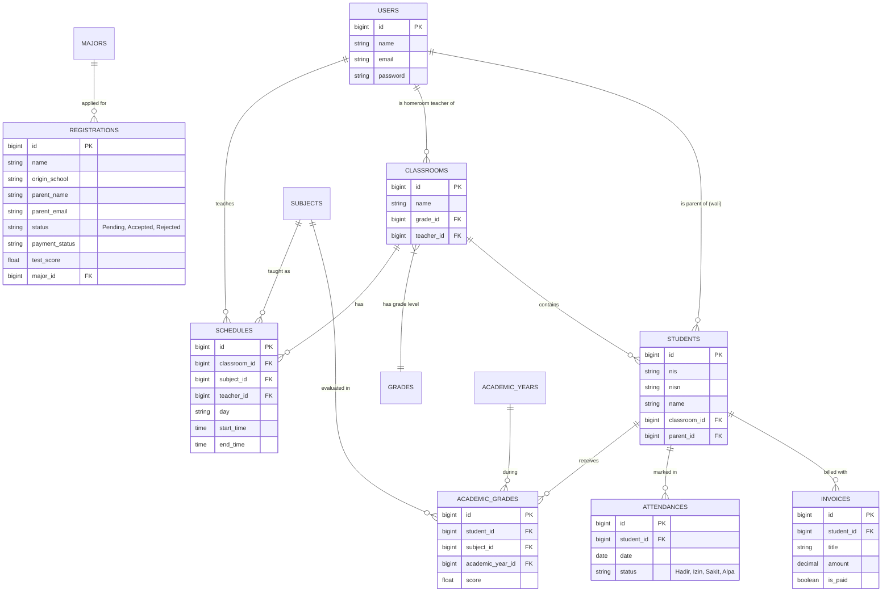

# Product Requirements Document (PRD) & Entity Relationship Diagram (ERD)
**Project:** Sistem Informasi Manajemen Sekolah (SIMS) Terpadu & PPDB Online

## 1. Pendahuluan
Proyek ini adalah sebuah platform terpadu (Sistem Informasi Manajemen Sekolah) yang menggabungkan tiga fungsi utama:
1. **Company Profile & Portal Informasi:** Wajah depan sekolah untuk publik (berita, pengumuman, profil).
2. **Sistem PPDB Online:** Pendaftaran murid baru, pembayaran formulir, hingga seleksi tes online.
3. **SIAKAD & Administrasi (Backend):** Pengelolaan akademik (jadwal, nilai/rapor, absensi) dan keuangan (SPP/tagihan) untuk siswa yang sudah aktif.

## 2. Aktor & Peran (User Roles)
Sistem ini menggunakan *Role-Based Access Control* (RBAC) dengan peran berikut:
- **Super Admin:** Akses penuh ke seluruh sistem, termasuk manajemen pengguna (User & Role) dan CMS website.
- **Tata Usaha (TU):** Mengelola operasional harian (validasi PPDB, plotting kelas/jadwal, manajemen tagihan/SPP, data master akademik).
- **Wali Kelas (Teacher):** Mengelola kelas yang diampunya, menginput nilai rapor, dan mencatat absensi siswa.
- **Wali Murid (Parent):** Memantau perkembangan akademik anak (rapor, absensi) dan menyelesaikan pembayaran tagihan SPP/sekolah.
- **Calon Siswa (Guest):** Mengakses form pendaftaran PPDB, melakukan pembayaran awal, dan mengikuti tes seleksi.

---

## 3. Alur Bisnis Utama (Core Flows) yang Ideal

> [!IMPORTANT]
> Bagian ini mendefinisikan *flow* yang seharusnya berjalan agar sistem terintegrasi dengan baik. Jika saat ini flow terasa "belum berjalan dengan baik", kemungkinan ada mata rantai yang terputus di alur ini (misal: pendaftar PPDB yang lulus belum terkonversi otomatis menjadi Siswa aktif).

### A. Alur PPDB (Penerimaan Peserta Didik Baru)
1. **Pendaftaran:** Calon siswa membuka halaman `/pendaftaran`, mengisi form data diri, asal sekolah, jurusan, dan data orang tua (sekaligus membuat password untuk akun wali murid nantinya).
2. **Pembayaran Formulir:** Sistem menghasilkan tagihan formulir. Calon siswa mengonfirmasi pembayaran (saat ini manual/transfer).
3. **Tes Seleksi:** Setelah pembayaran divalidasi, calon siswa mendapatkan akses mengerjakan Tes Online (CBT).
4. **Kelulusan & Konversi (Krusial):** 
   - TU meninjau nilai tes dan memutuskan status kelulusan (Accept/Reject).
   - **Jika Diterima (Accept):** Sistem **harus** secara otomatis:
     a) Membuat akun User dengan role `walimurid` (menggunakan email & password dari form PPDB).
     b) Membuat data `Student` (Siswa) baru yang terelasi dengan akun Wali Murid tersebut.
     c) Memasukkan siswa ke kelas sementara atau menunggu plotting TU.

### B. Alur Akademik (Jadwal, Absensi, & Rapor)
1. **Setup Awal (TU):** TU membuat master data (Tahun Ajaran, Jurusan, Mata Pelajaran).
2. **Plotting Kelas (TU):** TU membuat Kelas, menetapkan Wali Kelas, dan memasukkan data Siswa ke kelas tersebut.
3. **Input KBM (Wali Kelas):** Wali kelas menginput absensi harian dan nilai (`Grade`) per mata pelajaran untuk siswa di kelasnya.
4. **Monitoring (Wali Murid):** Orang tua login ke portal untuk melihat absensi dan mencetak/melihat Rapor (`Grade`) anaknya.

### C. Alur Keuangan (Tagihan & SPP)
1. **Generate Tagihan (TU):** TU membuat invoice/tagihan bulanan (SPP) dan menugaskannya ke siswa terkait.
2. **Pembayaran (Wali Murid):** Orang tua login, melihat daftar tagihan yang belum lunas, dan melakukan konfirmasi pembayaran.
3. **Validasi (TU):** TU mengecek mutasi rekening dan mengubah status tagihan menjadi `Paid` (Lunas).

---

## 4. Analisis Gap & Perbaikan yang Disarankan
Berdasarkan keluhan bahwa *"flow saat ini belum berjalan dengan baik"*, berikut adalah titik-titik krusial yang perlu dipastikan beroperasi:
- **Missing Link PPDB ke SIAKAD:** Apakah fungsi `accept` di `PpdbController` sudah otomatis membuat entri di tabel `users` (sebagai walimurid) dan tabel `students`? Jika belum, ini harus segera dibuat agar flow menyambung.
- **Relasi Wali dan Anak:** Validasi bahwa satu akun wali murid bisa melihat tagihan dari *lebih dari satu anak* jika mereka mendaftarkan kakak-beradik.
- **Pembayaran:** Apakah konfirmasi pembayaran masih manual? Perlu ditambahkan fitur upload bukti transfer agar TU mudah memvalidasi.

---

## 5. Entity Relationship Diagram (ERD)

Di bawah ini adalah struktur database yang memfasilitasi flow di atas:

